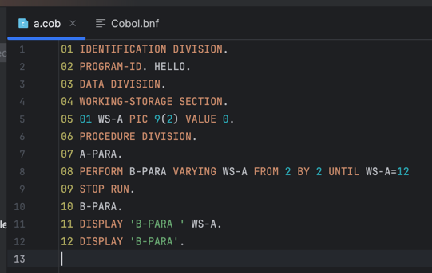

# IntelliJ COBOL Support

Simple IntelliJ IDEA plugin that adds basic COBOL language support: syntax highlighting, navigation, structure view, and references.

## Features

- COBOL file type with icon
- Syntax highlighting and color settings
- Structure view and navigation
- Basic reference resolution
- Goto my name

## Getting started

1. Open the project in IntelliJ IDEA.
2. Use the Gradle task `runIde` to launch a sandbox IDE with the plugin.
3. Open a `.cob`/`.cbl` file to try it out.

## License

MIT